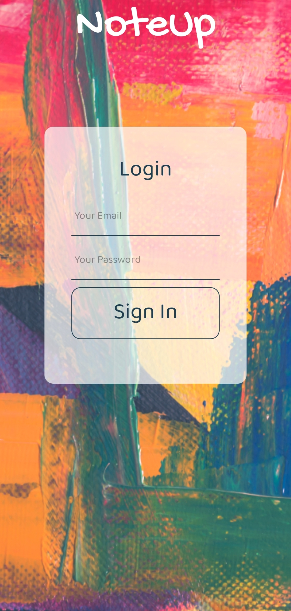
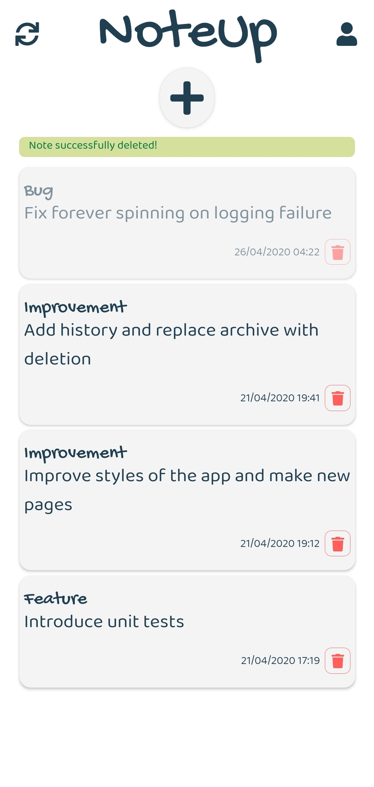
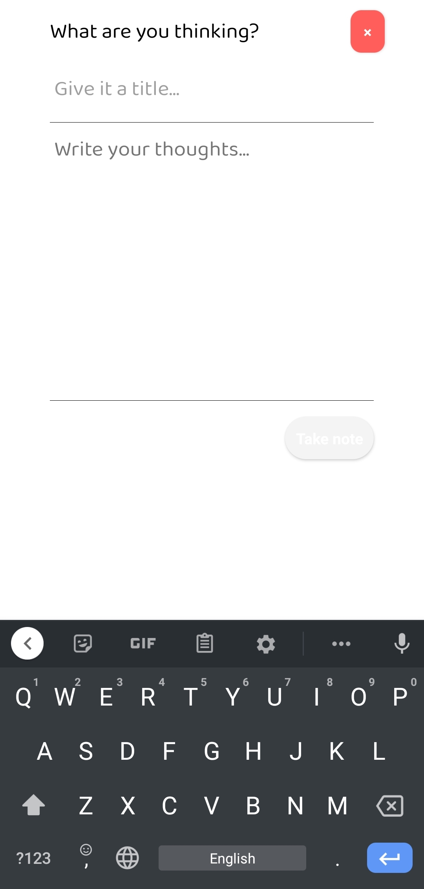
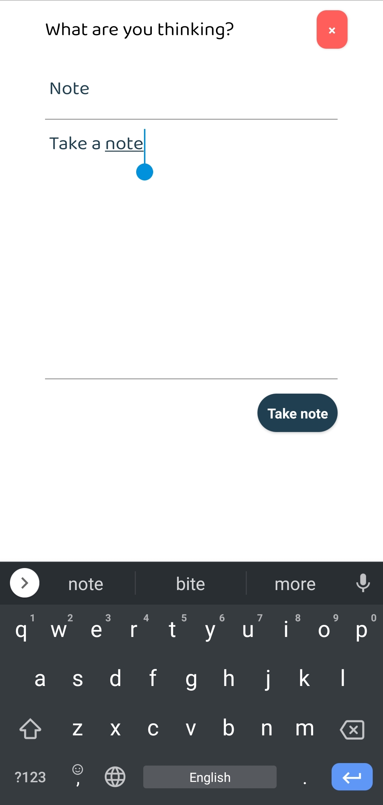

# noteup-public

this is the public version of my noteup application.

<!--
*** Thanks for checking out this README Template. If you have a suggestion that would
*** make this better, please fork the repo and create a pull request or simply open
*** an issue with the tag "enhancement".
*** Thanks again! Now go create something AMAZING! :D
-->

<!-- PROJECT SHIELDS -->
<!--
*** I'm using markdown "reference style" links for readability.
*** Reference links are enclosed in brackets [ ] instead of parentheses ( ).
*** See the bottom of this document for the declaration of the reference variables
*** for contributors-url, forks-url, etc. This is an optional, concise syntax you may use.
*** https://www.markdownguide.org/basic-syntax/#reference-style-links
-->

<!-- PROJECT LOGO -->
<br />
<p align="center">
    
    
    
      

  <h3 align="center">NoteUp</h3>

  <div style='list-style-type:none;' align="center">
    An simple note application.
    <br />
    <a href="https://github.com/othneildrew/Best-README-Template"><strong>Explore the docs »</strong></a>
    <br />
    <br />
    <div>   
        <a href="https://github.com/michalisKout/noteup/issues">Report Bug - Bug Label</a></div>
    <div>
        <a href="https://github.com/michalisKout/noteup/issues">Request Feature</a>
    </div>
    <div>
        <a href="https://github.com/michalisKout/noteup/issues">Request Account - Question Label</a>
    </div>
 
  </div>
</p>

<!-- TABLE OF CONTENTS -->

## Table of Contents

- [About the Project](#about-the-project)
  - [Built With](#built-with)
- [Getting Started](#getting-started)
  - [Prerequisites](#prerequisites)
  - [Installation](#installation)
- [Roadmap](#roadmap)
- [Contributing](#contributing)
- [License](#license)
- [Contact](#contact)

<!-- ABOUT THE PROJECT -->

## About The Project

[![NoteUp][product-screenshot]](src/assets/images/project_screenshots/add_note.jpg)

NoteUp is an easy and quick way to keep simple notes across your mobile devices. You can edit you notes instantly, archive them or delete them. Your notes will be saved directly to the firebase cloud using google authentication to keep them private.

**The Goal:**
the main idea is to evolve the application into a Getting Thing Done - GTD tool which will help users apply the principals of this technic. For more details on GTD you can read this article [GTD in 15 minutes](https://hamberg.no/gtd/#what-is-gtd).

### Built With

This app is build mainly with React Native in **front end** and a firebase/firestore infrastructure for **analytics, user authentication, continuous deployment, A/B testing and data storage**.

- [React Native](https://reactnative.dev/)
- [Firebase](https://firebase.google.com/)
- [Cloud Firestore](https://firebase.google.com/docs/firestore/?gclid=CjwKCAjw4pT1BRBUEiwAm5QuR4xPaRun0Rw-l6r2wjMFz2EmeqkSoWD7oXwifSUH6qQ3OmxAfpjnLRoCNLwQAvD_BwE)

_User registration is disabled for now. Accounts can be created upon request._

<!-- GETTING STARTED -->

## Getting Started

This is a React native application for Android OS. You will need to setup the environment properly to get start with the project.

### Prerequisites

- nodeJs >=12

```sh
nvm install 12.16.1
```

- Follow the React Native CLI Quickstart to setup a proper android simulator [here](https://reactnative.dev/docs/environment-setup).

### Installation

1. Request an Account creation opening an issue using "question" label. [here](https://github.com/michalisKout/noteup/issues)
2. Clone the repo

```sh
git clone https://github.com/michaliskout/noteup.git
```

3. Ensure that you have the correct NPM version. [Here](http://nvm.sh/) you can find more details about **nvm**.

```sh
nvm use
```

4. Install NPM packages

```sh
npm install
```

4. run the app into a real or a simulator android device

```sh
react-native run-android
```

<!-- ROADMAP -->

## Roadmap

See the [open issues](https://github.com/michalisKout/noteup/issues) for a list of proposed features (and known issues).

<!-- CONTRIBUTING -->

## Contributing

Contributions are what make the open source community such an amazing place to be learn, inspire, and create. Any contributions you make are **greatly appreciated**.

1. Fork the Project
2. Create your Feature Branch (`git checkout -b feature/AmazingFeature`)
3. Commit your Changes (`git commit -m 'Add some AmazingFeature'`)
4. Push to the Branch (`git push origin feature/AmazingFeature`)
5. Open a Pull Request

## Roadmap

### Upcoming features

- Unit Test coverage.
- Integrate Analytics.
- Google Account Sign In.
- Add archive functionality. Keep all the archived notes in a page where the user can visit and restore his notes or permanently delete them.
- Add GTD filters in notePopup section to apply GTD principles.
- Add grouping for notes. Add colored labeling for the groups. Add the ability to the user to name those groups.
- Add userProfile page where user can edit his profile details.

<!-- LICENSE -->

## License

Distributed under the MIT License. See `LICENSE` for more information.

<!-- CONTACT -->

## Contact

### Michalis Koutridis

### michalis.koutridis@gmail.com

[![Twitter][twitter-shield]][twitter-url]
[![LinkedIn][linkedin-shield]][linkedin-url]

Project Link: [https://github.com/michaliskout/noteup](https://github.com/your_username/repo_name)

<!-- MARKDOWN LINKS & IMAGES -->
<!-- https://www.markdownguide.org/basic-syntax/#reference-style-links -->

[depencencies-shield]: https://img.shields.io/https://github.com/michalisKout/noteup?style=flat-square
[contributors-url]: https://github.com/michalisKout/noteup/graphs/contributors
[depencencies-url]: https://github.com/michalisKout/noteup/network/dependencies
[forks-shield]: https://img.shields.io/github/forks/michalisKout/noteup.svg?style=flat-square
[forks-url]: https://github.com/michalisKout/noteup/network/members
[stars-shield]: https://img.shields.io/github/stars/michalisKout/noteup.svg?style=flat-square
[stars-url]: https://github.com/michalisKout/noteup/stargazers
[issues-shield]: https://img.shields.io/github/issues/michalisKout/noteup.svg?style=flat-square
[issues-url]: https://github.com/michalisKout/noteup/issues
[license-shield]: https://img.shields.io/github/license/michalisKout/noteup.svg?style=flat-square
[license-url]: https://github.com/michalisKout/noteup/blob/master/LICENSE.txt
[linkedin-shield]: https://img.shields.io/badge/-LinkedIn-black.svg?style=flat-square&logo=linkedin&colorB=555
[linkedin-url]: https://www.linkedin.com/in/michalis-koutridis-340774124/
[product-screenshot]: src/assets/images/project_screenshots/logo.jpg
[twitter-shield]: https://img.shields.io/badge/-Twiter-black.svg?style=flat-square&logo=twitter&colorB=555
[twitter-url]: https://twitter.com/MKoutridis?s=09
